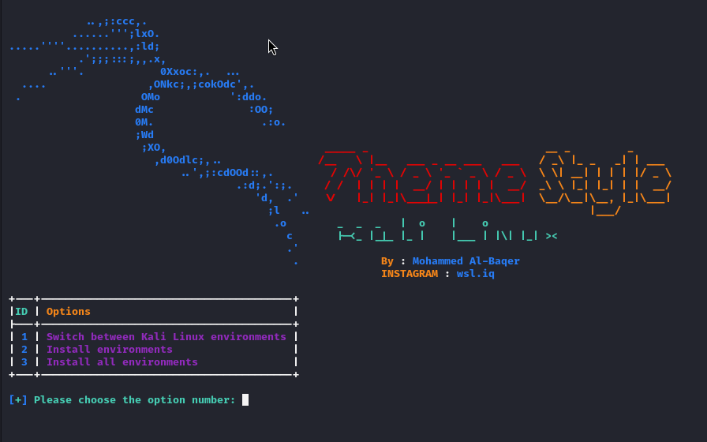
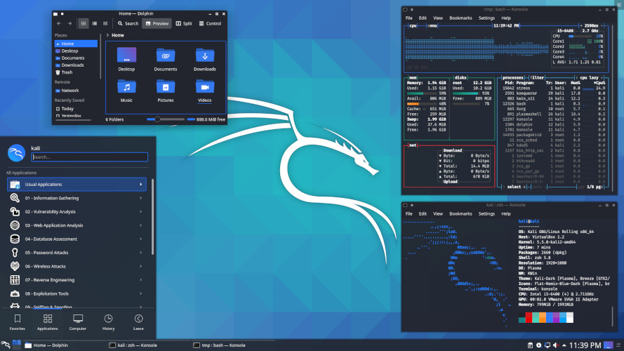

### **ScreenShot**



---

### **What Now?**
### **Version : 1.1.0**

- **Add BackRound in Version After**
- **BackRound `2019.4`**   
- **BackRound `2020.4`** 
- **BackRound `2021.4`** 
- **BackRound `2022`** 
- **BackRound `2023`** 
- **BackRound `2023 + Bobile`** 
- **BackRound `2024`** 
- **BackRound `2025`** 
- **BackRound `All Wallpapers for Kali Linux`** 
- **BackRound `Wallpapers Legacy`** 
- **BackRound `Kali Wallpapers community`** 
- **BackRound `Kali Linux everything`**

---


- **Desktop Environments `sddm`** 
- **Desktop Environments `lightdm`** 
- **Desktop Environments `gdm3`** 
- **Desktop Environments `gnome`** 
- **Desktop Environments `kde`** 
- **Desktop Environments `xfce`** 
- **Desktop Environments `lxde`** 
- **Desktop Environments `i3`** 
---
- **You have to make a choice from the three options.**
```
[1] Switch between Kali Linux environments
[2] Install environments
[3] Install all environments
```

### **Option number 1**
- **When you choose the first option, it allows you to move between the three environments as it exists.**
```
[1] gdm3
[2] lightdm
[3] sddm
```

### **Option number 2**
- **Allows you to download an environment of your choice from the seven environments.**
```
[1] lightdm
[2] gdm3
[3] kali-desktop-gnome
[4] kali-desktop-kde
[5] kali-desktop-xfce
[6] kali-desktop-lxde
[7] kali-desktop-i3
```

### **Option number 3**

- **Allows you to download all environments in one go**

### **kali-desktop-xfce**


### **kali-desktop-gnome**


### **kali-desktop-kde**





### **Installation (Kali Linux)**

```
$ git clone https://github.com/wsl-iq/Theme-Style.git
$ cd Theme-Style
$ chmod +x *
$ sudo python3 Style.py
```

### **uninstall**
```
$ bash uninstall.sh
```


### **[~] Find Me on :**
- [](https://instagram.com/wsl.iq)


