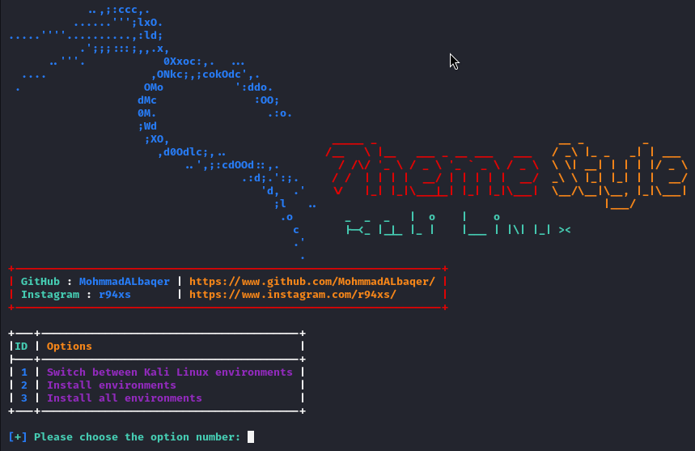
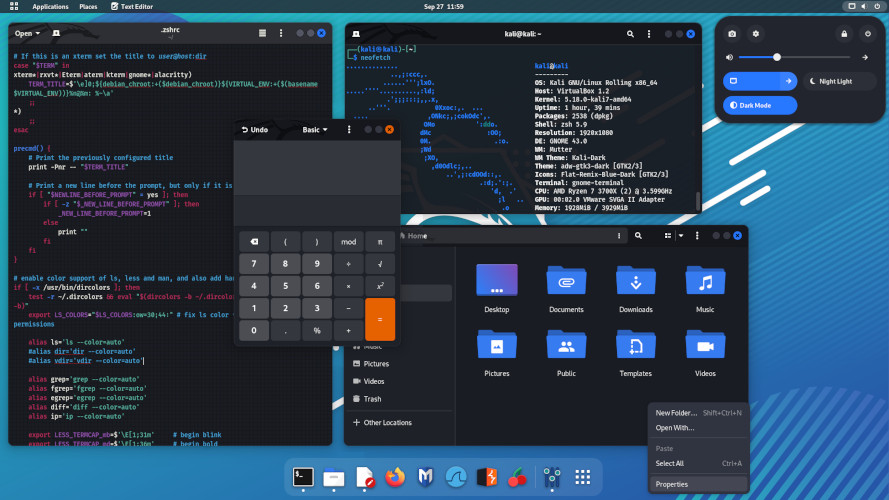
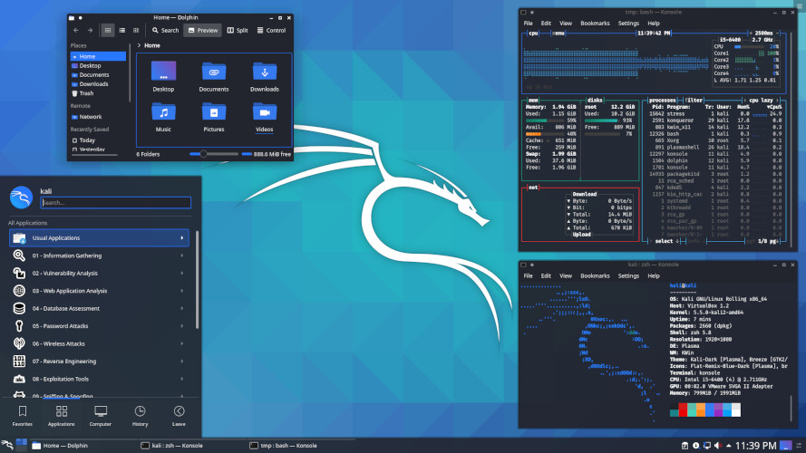

### ScreenShot





```
You have to make a choice from the three options.
[1] Switch between Kali Linux environments
[2] Install environments
[3] Install all environments
```

### Option number 1
```
When you choose the first option, it allows you to move between the three environments as it exists.

[1] gdm3
[2] lightdm
[3] sddm

```

### Option number 2
```
Allows you to download an environment of your choice from the seven environments.

[1] lightdm
[2] gdm3
[3] kali-desktop-gnome
[4] kali-desktop-kde
[5] kali-desktop-xfce
[6] kali-desktop-lxde
[7] kali-desktop-i3

```

### Option number 3
```
Allows you to download all environments in one go

```

### kali-desktop-xfce


### kali-desktop-gnome




### kali-desktop-kde





### Installation (Kali Linux)

```
$ git clone https://github.com/MohmmadALbaqer/ThemeStyle.git
$ cd ThemeStyle
$ sudo python3 Style.py
```


## [~] Find Me on :

- [](https://github.com/MohmmadALbaqer)


- [](https://instagram.com/r94xs)

